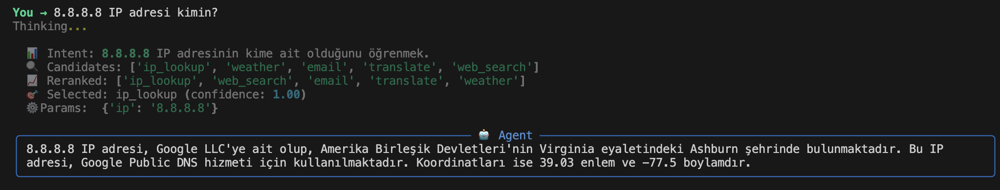
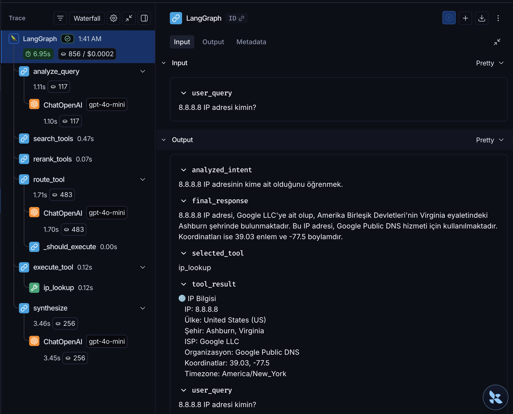
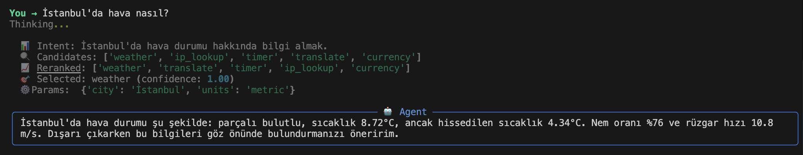
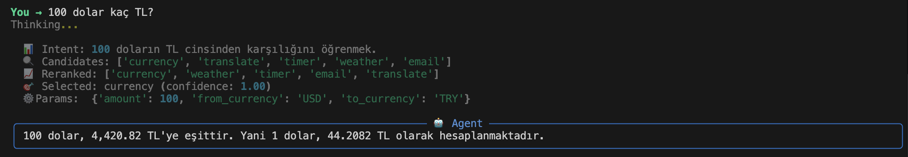
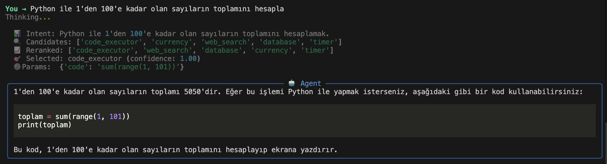
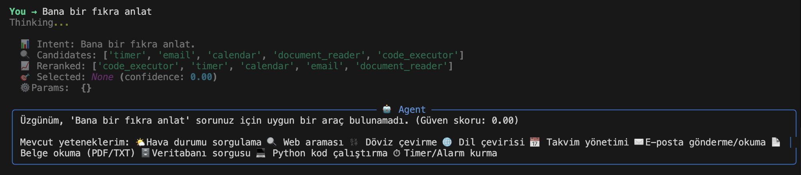

# Dynamic Tool Selection System

**Zero-knowledge agent** — başlangıçta hiçbir tool'u bilmiyor. Her sorgu için:
1. **Semantic Search** → Pinecone'dan aday tool'ları buluyor
2. **Reranking** → Cross-encoder ile false positive'leri eliyor
3. **LLM Routing** → GPT-4o-mini ile final tool seçimi + parametre çıkarımı

## 🛠 Mevcut Tool'lar (10)

| # | Tool | API |
|---|------|-----|
| 1 | Hava Durumu | OpenWeatherMap |
| 2 | Web Araması | Tavily |
| 3 | Döviz Çevirici | ExchangeRate-API |
| 4 | Çeviri | googletrans |
| 5 | Takvim | Google Calendar |
| 6 | E-posta | Gmail |
| 7 | Belge Okuyucu | pypdf + requests |
| 8 | Veritabanı | SQLite |
| 9 | Kod Çalıştırıcı | Python exec() |
| 10 | Timer/Alarm | APScheduler |

## 🚀 Kurulum

```bash
# 1. Virtual environment oluştur
python -m venv venv
source venv/bin/activate  # macOS/Linux

# 2. Dependencies kur
pip install -r requirements.txt

# 3. .env dosyasını oluştur
cp .env.example .env
# .env dosyasını düzenleyip API key'leri girin

# 4. Tool'ları Pinecone'a indexle (ilk seferde)
python main.py --index

# 5. Agent'ı çalıştır
python main.py
```

## 📁 Proje Yapısı

```
caseStudy/
├── main.py                 # Entry point (CLI + chat)
├── config.py               # Settings ve env variables
├── agent/                  # LangGraph state machine
│   ├── graph.py            # Graph tanımı
│   ├── state.py            # AgentState TypedDict
│   └── nodes/              # Graph node'ları
├── registry/               # Tool metadata yönetimi
├── search/                 # Semantic search pipeline
├── tools/                  # 10 gerçek tool implementasyonu
├── scripts/                # Utility scripts
└── tests/                  # Testler
```

## 🧩 Yeni Tool Ekleme (11. Tool)

```python
# 1. tools/my_new_tool.py oluştur
class MyNewTool(DynamicTool):
    ...

# 2. tools/loader.py → ALL_TOOL_CLASSES'a ekle
ALL_TOOL_CLASSES = [
    ...,
    MyNewTool,
]

# 3. Pinecone'a indexle
python main.py --index
```

Hiçbir agent kodu değişmez ✅

## Stack

- **LangGraph** → Agent orchestration
- **Pinecone** → Vector DB (tool embeddings)
- **LangChain** → Tool abstractions
- **OpenAI** → Embeddings + LLM routing
- **sentence-transformers** → Cross-encoder reranking

## 🛡️ Hata Yönetimi & Dayanıklılık (Error Recovery)

Sistem, dış servislerde (API, Network) oluşabilecek geçici hatalara karşı **Exponential Backoff** stratejisi ile otomatik retry mekanizmasına sahiptir:
- **Max Attempt:** 3 (Configurable)
- **Base Delay:** 1s (Üstel artış: 1s, 2s, 4s...)
- **Seçici Retry:** `ValueError`, `TypeError` gibi girdi hatalarında vakit kaybetmemek için retry yapılmaz, sadece geçici servis hatalarında devreye girer.

## 📈 İzlenebilirlik (Observability)

Proje **LangSmith** ile tam entegre çalışır. Tüm agent akışı, tool seçim kararları ve gecikme (latency) süreleri görsel olarak izlenebilir.
- Görselleştirme için `.env` dosyasında `LANGCHAIN_TRACING_V2=true` ayarlanması yeterlidir.

## 📸 Örnek Çıktılar

### Başarılı Senaryolar

#### 11. Tool — IP Lookup (Yeni eklenen tool)



#### Hava Durumu


#### Döviz Çevirme


#### Kod Çalıştırma


### Başarısız Senaryo (Tool Bulunamadı)
